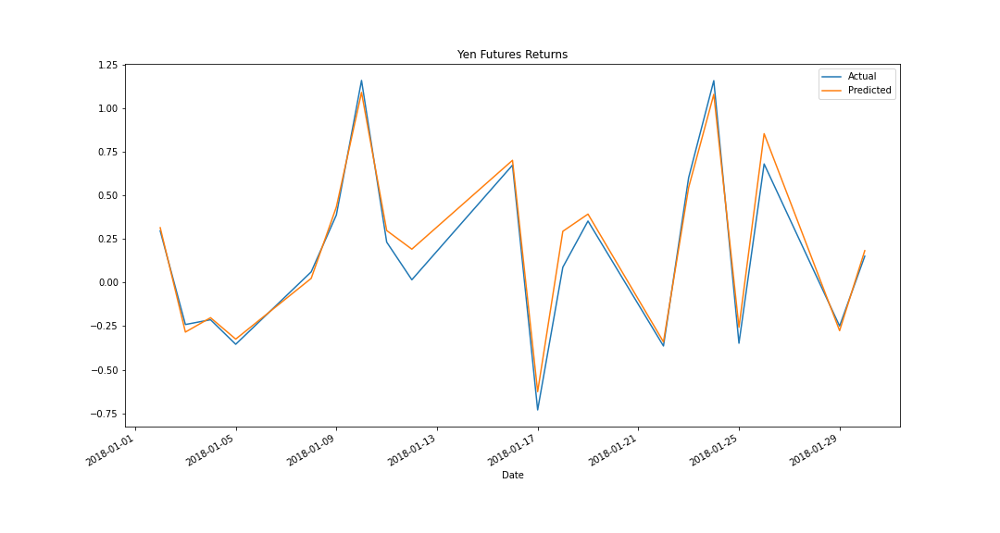
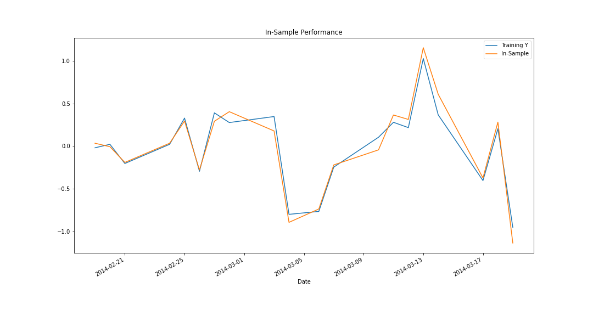

# 🐍💹 Forecasting Yen 💱🐍

Based on this analysis, I would not buy yen at this time.  
The risk is projected to increase.
I feel confident using these models to inform my trading decision.

This model performs slightly better on In-Sample data:
MSE: 0.0263 (In) vs. 0.0287 (Out)
RMSE: 0.1622 (In) vs. 0.1693 (Out)

